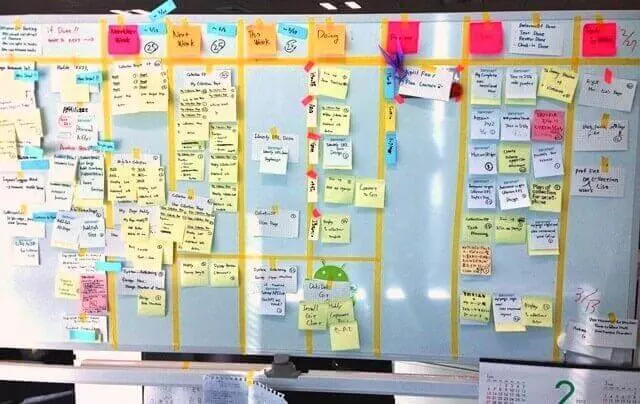

# Ferramentas Kanban

## O quadro kaban

No quadro kanban encontramos algumas separações e cartões das atividades que a equipe irá e está atuando.

## Ferramentas

*Trello*
> O Trello é uma das ferramentas Kanban mais populares. Inclusive, é a mais revisada no Software Advice. Na ferramenta você pode contar com uma conta gratuita com recursos básicos. Contudo, apenas para usuários individuais ou equipes que precisam apenas de Kanban simples.

*Jira*
> A ferramenta de desenvolvimento de software mais usada por equipes ágeis. Afinal, tem todos os recursos de que você precisa para planejar, acompanhar e lançar um ótimo software”. 

*Asana*
> O Asana tem uma ampla gama de recursos para Kanban. Portanto, é uma ferramenta de desenvolvimento bem completa. Além disso, ela oferece um rico conjunto de recursos de gerenciamento de fluxo de trabalho.

*Monday*
> Monday é uma das ferramentas Kanban altamente avaliadas por usuários no Software Advice. Ela tem 4,63 estrelas com base em mais de 2.100 avaliações de usuários.

*Wrike*
> O Wrike oferece recursos de gerenciamento de fluxo de trabalho personalizáveis. Portanto, facilitam à empresa criar, compartilhar e editar quadros Kanban.